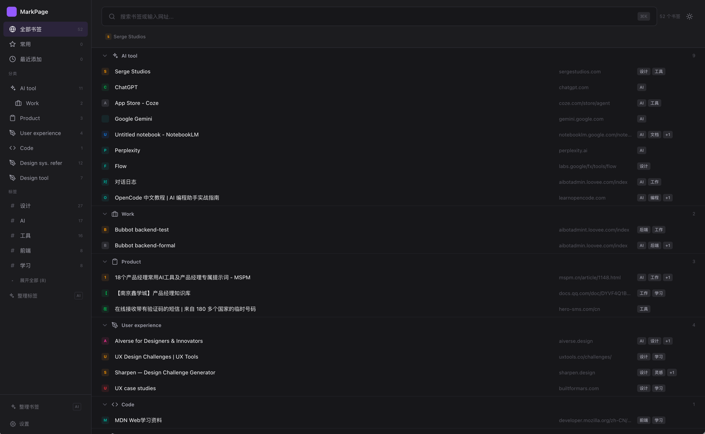
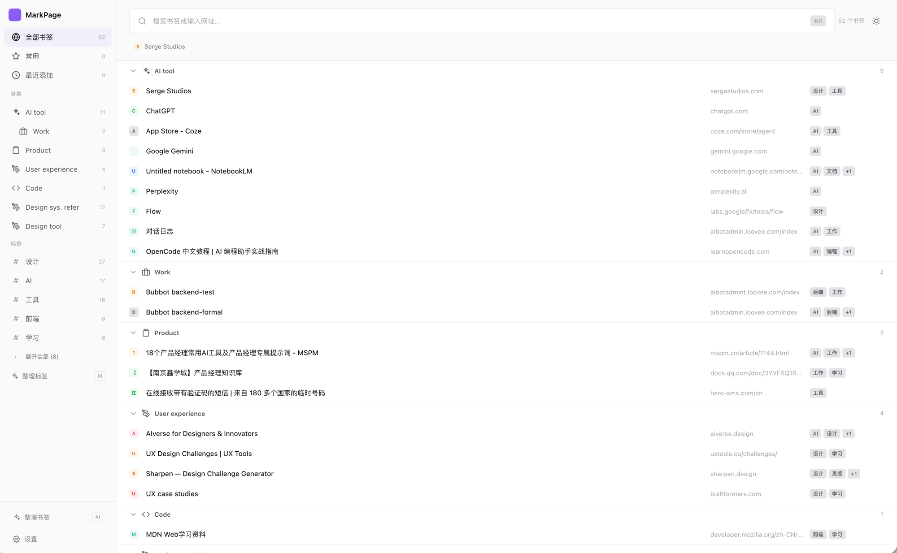

<p align="center">
  
</p>

<p align="center">
  Linear 风格的智能书签管理 Chrome 扩展 —— AI 自动分类、标签整理、美观新标签页。
</p>

## 界面预览

| 深色模式 | 浅色模式 |
| :---: | :---: |
|  |  |

## 功能截图

### AI 自动标记


### AI 整理旧书签


### 智能搜索


### 自定义样式


## 功能亮点

- **AI 自动打标 / 分类**：新增书签时，后台自动调用 AI 推荐标签与归类
- **标签管理**：侧边栏双击重命名、悬浮删除；AI 一键整理混乱的标签体系
- **统一搜索**：书签 / 标签 / 拼音首字母，Cmd/Ctrl + K 快捷呼出
- **常用站点**：右键"设为常用"后在顶部快捷访问
- **主题与强调色**：支持深浅色、系统跟随、自定义主色

## 安装方式

### 方式一：从源码构建并以"开发者模式"加载

1. 克隆仓库并安装依赖

   ```bash
   git clone https://github.com/Yeung9203/MarkPage.git
   cd MarkPage
   npm install
   ```

2. 构建产物

   ```bash
   npm run build
   ```

   构建完成后会在项目根目录生成 `dist/` 文件夹。

3. 在 Chrome 中加载已解压的扩展

   1. 打开 `chrome://extensions`
   2. 右上角打开 **开发者模式**
   3. 点击 **加载已解压的扩展程序**
   4. 选择项目下的 `dist/` 目录

4. 打开一个新标签页即可看到 MarkPage。

### 方式二：本地开发模式（修改即时生效）

```bash
npm run dev
```

以开发者模式加载 `dist/` 后，修改源码时 Vite 会自动重新构建，扩展管理页点击刷新即可看到更新。

## 配置 AI（可选）

MarkPage 的 AI 能力（自动打标、分类、标签整理）需要配置一个兼容 OpenAI 的 API：

1. 点击新标签页左下角的 **设置**
2. 打开 **AI 功能**，填入：
   - API Base URL（如 `https://api.openai.com/v1`）
   - API Key
   - 模型名（如 `gpt-4o-mini`）
3. 保存后即刻生效；关闭 AI 开关则所有 AI 相关能力会被跳过。

> 密钥仅保存在本地 `chrome.storage.local`，不会上传任何服务器。

## 技术栈

- TypeScript + Vite
- 原生 DOM（无运行时框架），轻量快速
- Chrome Extension Manifest V3

## 许可

MIT
